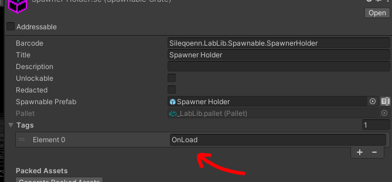
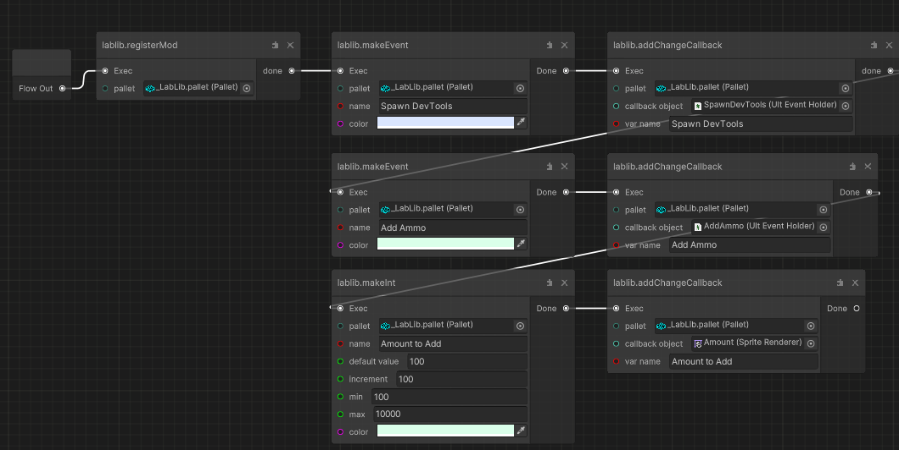
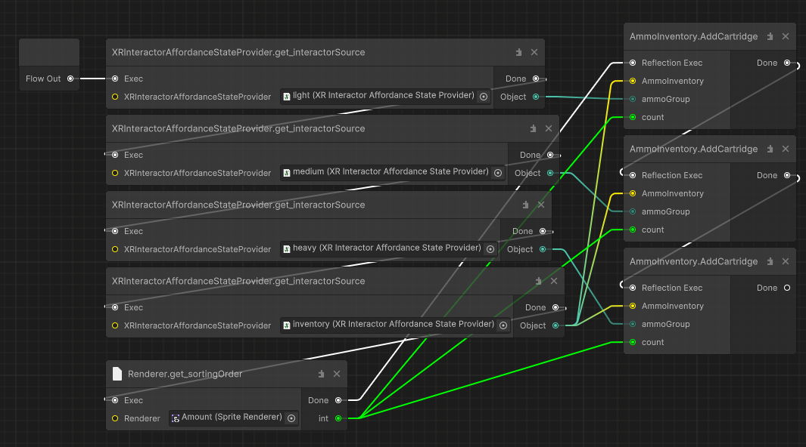

# LabLibSDK
SDK for a Bonelab mod, for mimicking BoneLib

# Features
- A menu system for other mods to use
- Spawn message boxes for the player
- Spawning your spawnables on scene start
- ModPage variables persist between game sessions

[LabLib mod is required for the noodled events to work](https://mod.io/g/bonelab/m/lablib-partial-bonelib-port#description)

The Menu system and Message box manager are accesible via a custom [Noodled Events](https://github.com/holadivinus/Noodled-Events) cookbook
add this to your project using git to get the cookbook

# How to make your spawnable spawn on scene start:
This is usefull for initializing your ModPage and background logic
  
its simple - just add an "OnLoad" tag to your crate

# When publishing mods made with this !IMPORTANT!
you must add LabLib as a dependency

# Node documentation
Currently there are 10 nodes:
---
- **lablib.registerMod**
  - `Makes a page for your mod in the labmenu`
  - > Takes in a pallet (Pallet)
  - > const parameters, (using returned values in a parameter wont work)
---
- **lablib.addChangeCallback**
  - `Invokes provided UltEventHolders on adding (If the variable isnt an event) or when a variable changes or when an event button is pressed`
  - Also depending on the type of the variable `copies variable value to Component Storages`:
    - `Mask`, with the `showMaskGraphic` property as bool storage
    - `SpriteRenderer`, with the `Renderer.sortingOrder` property as int, enum storage
    - `DelayedUltEventHolder`, with the `Delay` property as float storage
  - > Takes in a pallet (Pallet), callback object (UnityEngine.Object), variable name (string)
  - > const parameters
---
- **lablib.notify**
  - `Spawns a message box`
  - `Type determines which icon will the message box have`, currently there are 4 types
    - 0 - Error
    - 1 - Warning
    - 2 - Information
    - 3 - Success
  - > Takes in a pallet (Pallet), title (string), subtitle (string), type (int), hold (float)
  - > non const parameters (using returned values in a parameter will work)
---
- **lablib.makeUiSpacing**
  - `Make a space in your mod page's UI`
  - > Takes in a pallet (Pallet)
  - > const parameters
---
- **lablib.makeUiTitle**
  - `Makes a title in your mod page's UI`
  - > Takes in a pallet (Pallet), text (string), color (Color)
  - > const parameters
---
- **lablib.makeBool**
  - `Makes a Bool element in your mod page's UI`
  - > Takes in a pallet (Pallet), name (string), default value (bool), color (Color)
  - > Supported callback objects: UltEventHolder, Mask
  - > const parameters
---
- **lablib.makeInt**
  - `Makes an Int element in your mod page's UI`
  - > Takes in a pallet (Pallet), name (string), default value (int), increment (int), min (int), max(int), color (Color)
  - > Supported callback objects: UltEventHolder, SpriteRenderer
  - > const parameters
---
- **lablib.makeFloat**
  - `Makes a Float element in your mod page's UI`
  - > Takes in a pallet (Pallet), name (string), default value (float), increment (float), min (float), max(float), color (Color)
  - > Supported callback objects: UltEventHolder, DelayedUltEventHolder
  - > const parameters
---
- **lablib.makeEnum**
  - `Makes an Enum element in your mod page's UI`
  - `Enum value array must have at least 2 enum values, and must be in this format`: "ValueName", "ValueName", "ValueName"
  - > Takes in a pallet (Pallet), name (string), enum value array (string), color (Color)
  - > Supported callback objects: UltEventHolder, SpriteRenderer
  - > const parameters
---
- **lablib.makeEvent**
  - `Makes an Event element in your mod page's UI`
  - > Takes in a pallet (Pallet), name (string), color (Color)
  - > Supported callback objects: UltEventHolder
  - > const parameters
---
# Example Usage
**Mod Initialization**

Making the ModPage, adding elements to it, and subscribing ult events/comp storages to events.

Also Note:

  if adding an Event AND Value Callback to a single variable - the value should be added first, im too lazy to explain why.
     
**Using Callbacks**

the ultevent youre seeing is subscribed to an Event element, the Amount (Sprite Renderer) is subscribed to an Int Element.
